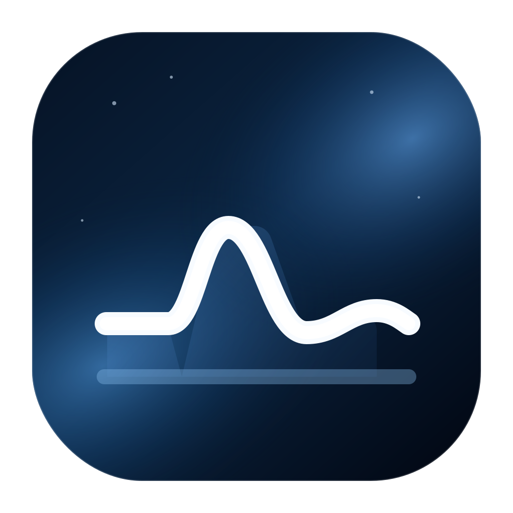
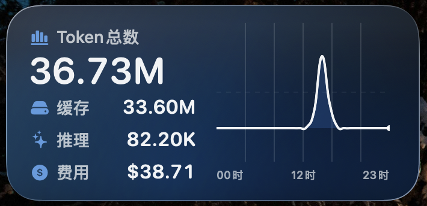

# CPA Visualize Widget

中文 | [English](README.md)

<p align="center">
  
</p>

<p align="center">
  
</p>

CPA Visualize Widget 是一个 macOS SwiftUI 应用与 WidgetKit 桌面小组件，用于在桌面上查看 Usage Keeper 的用量统计。宿主应用负责保存 Usage Keeper 连接配置、定时同步快照，并通过 App Group 将数据共享给桌面小组件。

## 功能特性

- 在桌面小组件中快速查看 CPA / Usage Keeper 用量。
- 展示今日 Token 总数、缓存 Token、推理 Token 和费用。
- 展示按小时聚合的 Token 趋势曲线。
- 支持 Usage Keeper 密码登录，并使用 Keychain 保存会话。
- 通过 App Group 在宿主应用与 Widget 扩展之间共享快照。
- 宿主应用每 5 分钟自动同步，WidgetKit 从共享快照刷新展示。

## 下载使用

从项目 Releases 页面下载 `CPAVisualize.dmg`，打开 DMG 后将 `CPAVisualize.app` 拖入 `/Applications` 即可运行。

当前构建仅支持 macOS 26，因为应用使用了 Liquid Glass 组件。

## 项目结构

```text
Assets/               项目图标与视觉资源
CPAVisualizeApp/      macOS 宿主应用、设置界面、同步逻辑、存储逻辑
CPAWidgetExtension/   WidgetKit 扩展与小组件 SwiftUI 视图
Shared/               共享模型与常量
scripts/              本地构建、安装和打包脚本
```

## 环境要求

- macOS 26 或更新版本。
- 本地构建需要安装 Xcode。
- 一个正在运行的 Usage Keeper 服务。
- 使用你自己的 Apple Developer 账号配置 Bundle Identifier 与 App Group，并确保它们和 `CPAVisualizeConfiguration.appGroupIdentifier` 保持一致。

## 使用方式

1. 使用 Xcode 打开 `CPAVisualize.xcodeproj`。
2. 将项目里的占位 Bundle Identifier 和 App Group Identifier 替换为你自己的值。
3. 构建并运行 `CPAVisualize` scheme。
4. 在宿主应用里填写 Usage Keeper URL。
5. 如果 Usage Keeper 开启了密码登录，打开对应开关并填写密码。
6. 保存设置，等待共享快照同步完成。
7. 在桌面添加 `CPA Usage` 小组件。

## 本地重建与安装

```bash
./scripts/rebuild-and-install.sh
```

该脚本会保留 UserDefaults 和 Keychain 中的配置，只清理构建产物和 Widget 运行缓存。

## 构建 DMG

```bash
./scripts/build-dmg.sh
```

生成的文件会写入 `dist/CPAVisualize.dmg`，并使用 `Assets/CPAVisualize.icns` 作为图标。

## 图标

项目图标位于 `Assets/app-icon.svg`，生成的 macOS 图标位于 `Assets/CPAVisualize.icns`。图标的图表隐喻参考了 MIT 许可的 Tabler Icons `chart-area-line` 方向，并在本项目中重新设计成自定义 SVG 图标。

## 开源协议

本项目使用 MIT License 开源，详见 [LICENSE](LICENSE)。

## 说明

生成的构建产物、本地工具目录、DMG 打包产物和无关临时项目已经通过 `.gitignore` 过滤，不属于仓库内容。
